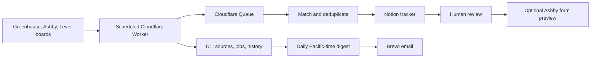

# Job Search Assistant

A job discovery and application workflow built with Cloudflare Workers, D1, Queues, Notion, and Brevo. It monitors employer career boards, explains why a role may fit, preserves the user's application history in Notion, and sends a daily review digest.

The project began as a personal search for early-career ML, applied AI, forward-deployed, and software engineering roles. The public repository contains the implementation and example configuration. Live account IDs, tokens, resumes, application answers, and Notion records stay local or in service secrets.

## How it works



The Worker scans supported boards every six hours. Each opening gets a stable identity from its employer job ID or posting URL. The first scan establishes a baseline; later scans can identify newly discovered roles without claiming to know when an employer posted them. A failed feed remains a visible coverage error and cannot silently close jobs.

Matching is rule based and explainable. It checks location, role family, seniority, experience requirements, and start-date compatibility, then labels roles **Strong**, **Possible**, or **Skip** with reasons. Notion remains the dashboard: existing application stages and notes are preserved, company watchlist entries remain separate, and one page is created per new opening. The `Role Lane` property groups FDE / Deployment, Applied AI, Startup SWE, ML / Data, and Other roles.

Application support is deliberately narrow. The Ashby adapter can preview a standard form with an approved profile. Unknown questions, essays, referrals, assessments, login requirements, and uncertain submission outcomes stop the workflow for review. Submission is disabled by default and requires profile and role approval. This is a prototype for a personal workflow, not a general-purpose applicant bot.

## Engineering choices

| Concern            | Implementation                                                                                                                                     |
| ------------------ | -------------------------------------------------------------------------------------------------------------------------------------------------- |
| Duplicate jobs     | Employer IDs, canonical posting links, and links embedded in Notion titles; shared application portals never identify a job                        |
| Notion edits       | Import existing records before syncing, preserve user-owned fields, and reconcile uncertain page creation before retrying                          |
| Feed reliability   | Track each source's last success and error; only a complete successful scan can close missing jobs                                                 |
| Email timing       | Pacific local-day check every 15 minutes to handle daylight saving time and send at most one digest per day                                        |
| Application safety | Verified answers, resume fingerprint, posting fingerprint, pre-submit Notion check, global pause, and no automatic retry after an uncertain submit |
| Free-tier budget   | Small queue batches, three application attempts and nine reserved browser minutes per day                                                          |

## Run it locally

Node.js 22 or newer is recommended.

```bash
npm ci
cp wrangler.example.jsonc wrangler.jsonc
cp src/company-sources.example.json src/company-sources.json
npm run check
npm run build
```

`npm run check` runs TypeScript validation and tests for duplicate scans, matching, Notion preservation, daylight saving time, email retries, and application holds. `npm run preview` reads public job feeds and writes a local report under ignored `reports/`. If a private Notion snapshot is absent, it treats the existing application list as empty.

The example configuration is safe to publish. To deploy your own instance, replace the placeholder D1 and Notion IDs in `wrangler.jsonc`, edit the private company source list, and create the Worker secrets `ADMIN_TOKEN`, `NOTION_TOKEN`, `BREVO_API_KEY`, and `BREVO_SENDER` with `npx wrangler secret put NAME`. Create the D1 database and Queues named in the config, apply `migrations/0001.sql`, then run `npm run deploy`. The Worker starts paused with syncing, email, and submissions disabled. See the [operations guide](docs/operations.md) for the staged activation process.

## Repository layout

```text
src/                 Worker, feed adapters, matching, Notion, digest, forms
migrations/          D1 schema
scripts/             Local preview and authenticated admin commands
test/                Behavior tests using an in-memory SQLite stand-in
.github/             CI and dependency update configuration
docs/                Operations and design notes
```

## Automated maintenance

GitHub Actions checks the project on pushes and pull requests and runs a weekly scheduled check. Dependabot proposes weekly dependency updates. A daily workflow refreshes [`data/public-board-snapshot.json`](data/public-board-snapshot.json) from three public example boards and commits only when the actual relevant openings change. These bot-authored commits show real source changes; they are not backdated or a substitute for authored engineering work. The live personal job discovery schedule runs in Cloudflare and writes to Notion, not to GitHub.

A second daily workflow opens [one small build task](.github/build-tasks.json) at a time. Finishing the task and closing its issue unlocks the next one. This gives the owner a steady path to real commits and visible progress without flooding the repo with artificial changes.

## Limits

Only supported Ashby, Greenhouse, and Lever boards are scanned automatically. Custom career sites stay in a manual coverage list. Match labels are a shortlist for human review, not an eligibility verdict. The public repo has no live credentials, personal resume, or application history, so it cannot reproduce the owner's private Notion data.
